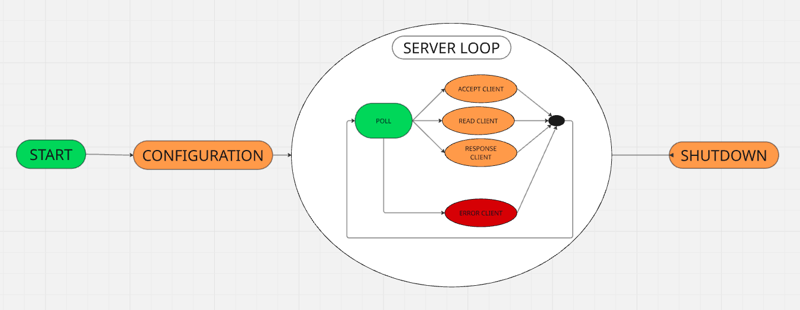

# WebServ

## Table des matières
- [Introduction](#introduction)
- [Règles à suivre](#règles-à-suivre)
- [Configuration d'un serveur](#configuration-dun-serveur)
- [Fonctionnement du projet](#fonctionnement-du-projet)
- [License](#license)

## Introduction

WebServ est un projet écrit en **C++98** qui permet de créer un serveur web simple mais performant. Il vise à simuler le comportement d'un serveur comme **Nginx** ou **Apache**, tout en se concentrant sur les aspects fondamentaux des requêtes HTTP et des protocoles réseau.

Ce projet est conçu pour aider les développeurs à comprendre les mécanismes internes d'un serveur web et à acquérir de l'expérience dans la gestion des connexions réseau, l'analyse des requêtes, ainsi que la gestion des ressources système sous **C++98**.

## Règles à suivre

- **Respect de la structure HTTP 1.1** : Le serveur doit comprendre et respecter la structure des requêtes et des réponses HTTP.
- **Gestion des erreurs** : Le serveur doit retourner des erreurs claires pour chaque situation incorrecte (par exemple, une erreur 404 pour "Page non trouvée").
- **Optimisation des performances** : Le serveur doit être optimisé pour gérer plusieurs requêtes simultanément, en respectant des délais de réponse courts.


## Configuration d'un serveur

### Exemple de fichier de configuration

Dans WebServ, il est possible de configurer plusieurs serveurs avec des adresses IP et des ports différents. Voici un exemple de fichier de configuration que tu peux utiliser pour configurer plusieurs serveurs.

Tu peux copier ce fichier directement et le personnaliser selon tes besoins.

---

```json
{
	server {
		listen 8080;
		listen 8081;
		server_name example.com;
		host 127.0.0.1;
		client_max_body_size 1000000000;
		autoindex off;

		location /t2/ {
			return /tr/;
		}

		location /t1/ {
			return /t2/;
		}

		location /conect {
			allow_methods POST DELETE GET;
		}

		location / {
			allow_methods POST DELETE GET;
			index index.html;
		}

		location /conect/delete {
			index index.html;
			allow_methods POST GET DELETE;
		}

		location /conect/upload {
			autoindex on;
			allow_methods GET POST;
			index index.html;
			# return /conect/delete/;
		}

		location /tr/ {
			return /;
		}

		location /test/ {
			return /conect/upload/;
		}

		location /cgi/ {
			allow_methods GET POST;
			cgi_ext .py .js;
		}

		location /dd {
			cgi_ext .py;
		}
	}
}

```

## Méthodes HTTP acceptées

### GET
- **Fonction** : Récupérer des données ou des ressources sans les modifier.
- **Exemple** : Demander une page web ou une image.
- **Utilisation dans WebServ** : Le serveur renverra des fichiers comme des pages HTML.

### POST
- **Fonction** : Envoyer des données au serveur (par exemple, un formulaire).
- **Exemple** : Soumettre des informations comme un nom d'utilisateur ou un fichier.
- **Utilisation dans WebServ** : Le serveur peut traiter et enregistrer des données envoyées par le client.

### DELETE
- **Fonction** : Supprimer une ressource sur le serveur.
- **Exemple** : Supprimer un fichier ou une donnée spécifique.
- **Utilisation dans WebServ** : Le serveur supprime un fichier ou une ressource demandée.

## Logique du serveur

Le serveur WebServ fonctionne en suivant une architecture modulaire et un processus en plusieurs étapes afin de gérer les requêtes HTTP de manière efficace. Lorsqu'une requête est reçue, le serveur suit la logique suivante :

1. **Réception de la requête** : Le serveur écoute sur les ports spécifiés dans la configuration et attend les connexions entrantes. Dès qu'une requête est reçue, elle est analysée pour déterminer la méthode HTTP et l'URL demandée.
2. **Multiplexage des connexions avec `poll`** : Le serveur utilise la fonction `poll` pour le multiplexage des connexions. Cela lui permet de gérer plusieurs connexions simultanément de manière asynchrone, en ne bloquant jamais sur une seule connexion. Le serveur peut ainsi attendre plusieurs événements, comme une nouvelle requête ou une réponse, sans se bloquer.
3. **Traitement de la requête** : Le serveur identifie les règles de configuration qui correspondent à la requête. Selon les paramètres définis (comme les méthodes autorisées, les types de contenu, ou les routes spécifiques), il détermine la réponse appropriée.
4. **Exécution des actions** : Si la méthode HTTP est valide, le serveur effectue les actions nécessaires. Par exemple, pour une requête `GET`, il renvoie un fichier, pour un `POST`, il traite les données envoyées.
5. **Envoi de la réponse** : Une fois le traitement effectué, le serveur renvoie une réponse HTTP appropriée, contenant soit les données demandées, soit un message d'erreur en cas de problème.

La gestion des connexions multiples grâce à `poll` permet au serveur d'être hautement performant et capable de traiter simultanément un grand nombre de requêtes sans perte de réactivité.



